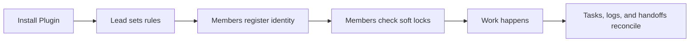

# Remote Agent Collaboration Lite

If you are vibe coding with friends, cofounders, contractors, or several AI agents, this is the lightweight coordination layer you want before the repo turns into scattered chats and duplicate edits.

Remote Agent Collaboration Lite gives your small team two Markdown Skills, Lead and Member, plus shared project files for actor identity, soft locks, logs, optional tasks, and optional module boundaries.

No server, no database, no hooks, and no custom collaboration CLI.
Just Markdown files and optional Git.

If this helps your AI coding workflow, a GitHub star helps others discover it.

Install both Skills. Use one role per thread.

- `team-lead-collaboration`
- `team-member-collaboration`

Start one Lead thread:

```text
$team-lead-collaboration Set up lightweight collaboration for this project.
```

Start Member threads:

```text
$team-member-collaboration Work on my assigned scope and update the shared collaboration log.
```



## Install

### Option 1 - Codex Plugin (preferred)

Plugin name: `remote-agent-collaboration-lite`
Plugin display name: `Remote Agent Collaboration Lite`
Marketplace name: `remote-agent-collaboration-lite`
Version: `0.5.0`

Add this repository marketplace:

```powershell
codex plugin marketplace add Gary06868/remote-agent-collaboration-skills
```

Adding the marketplace does not install the Plugin.

Install it from Codex:

1. Open `/plugins`.
2. Choose the `Remote Agent Collaboration Lite` marketplace.
3. Install `Remote Agent Collaboration Lite`.
4. Start a fresh Codex thread.
5. Verify both Skills are visible:
   - `team-lead-collaboration`
   - `team-member-collaboration`
6. Activate exactly one role in that thread.

This README uses `/plugins` for Plugin installation. It does not list a non-interactive install command unless that command is verified for this repository.

Update later:

```powershell
codex plugin marketplace upgrade remote-agent-collaboration-lite
```

Remove the marketplace if needed:

```powershell
codex plugin marketplace remove remote-agent-collaboration-lite
```

Uninstalling or disabling the Plugin must not delete project collaboration files such as `AGENTS.md`, `COLLAB_LOG.md`, `TEAM_TASKS.md`, `MODULE_OWNERSHIP.md`, or `.collab/`.

### Option 2 - Built-in Skill Installer

The built-in `$skill-installer` is a local fallback concept, but this repository does not publish it as a verified install path yet. Use the Plugin path above, or the manual copy path below for development and recovery.

### Option 3 - Manual Copy

Use this for development, local recovery, or environments without plugin support. Current Codex Skills documentation uses `.agents/skills` for repository and user-level Skill discovery.

Windows PowerShell from the repository root:

```powershell
$skills = Join-Path $env:USERPROFILE ".agents\skills"
New-Item -ItemType Directory -Force $skills | Out-Null
Remove-Item -Recurse -Force (Join-Path $skills "team-lead-collaboration") -ErrorAction SilentlyContinue
Remove-Item -Recurse -Force (Join-Path $skills "team-member-collaboration") -ErrorAction SilentlyContinue
Copy-Item -Recurse -Force .\skills\team-lead-collaboration (Join-Path $skills "team-lead-collaboration")
Copy-Item -Recurse -Force .\skills\team-member-collaboration (Join-Path $skills "team-member-collaboration")
Get-ChildItem $skills | Where-Object Name -in @("team-lead-collaboration", "team-member-collaboration")
```

macOS/Linux shell:

```bash
mkdir -p "$HOME/.agents/skills"
rm -rf "$HOME/.agents/skills/team-lead-collaboration"
rm -rf "$HOME/.agents/skills/team-member-collaboration"
cp -R skills/team-lead-collaboration "$HOME/.agents/skills/team-lead-collaboration"
cp -R skills/team-member-collaboration "$HOME/.agents/skills/team-member-collaboration"
find "$HOME/.agents/skills" -maxdepth 1 -type d \( -name team-lead-collaboration -o -name team-member-collaboration \)
```

These commands are safe to run repeatedly: they remove only the two target Skill directories before copying fresh files.

Project-level install uses `<PROJECT_ROOT>/.agents/skills` with the same two target directories. See [docs/INSTALLATION.md](docs/INSTALLATION.md).

Verify both Skills are visible in your AI coding environment's Skill picker or model-visible Skill list:

- `team-lead-collaboration`
- `team-member-collaboration`

## For AI Agents: Install the Plugin and Verify Both Skills

Copy this instruction into a fresh Agent when you want it to install the product:

```text
Install the Remote Agent Collaboration Lite Plugin from:
Gary06868/remote-agent-collaboration-skills

Use this verified marketplace step first:
codex plugin marketplace add Gary06868/remote-agent-collaboration-skills

Then open /plugins and install:
Remote Agent Collaboration Lite

Requirements:
- Install one Plugin that bundles both Skills.
- Verify these two Skills are separately visible:
  - team-lead-collaboration
  - team-member-collaboration
- Do not merge the Skills.
- Do not install hooks.
- Do not install a custom collaboration CLI.
- Start a fresh thread.
- Activate exactly one role in that thread:
  $team-lead-collaboration
  or:
  $team-member-collaboration
- Do not activate the other role in the same thread.
- Report Plugin version 0.5.0, Plugin name remote-agent-collaboration-lite, marketplace name remote-agent-collaboration-lite, and both visible Skill names.
```

## What This Is

Remote Agent Collaboration Lite is a Markdown-only collaboration workflow for one project lead and multiple contributors. Contributors can be humans, Codex threads, Claude threads, other AI agents, or a mix of all of them.

It does not try to enforce permissions. It gives agents explicit instructions to read the same project files, claim work before editing, avoid conflicting scopes, and leave short handoff notes.

Use it when:

- A small team or tiny company is building in one repository.
- Several AI threads may edit related files.
- You want a lead agent to coordinate work without introducing infrastructure.
- You need lightweight logs and soft locks instead of a full project management system.
- You want a new contributor to understand the collaboration rules in five minutes.

## Core Files

| File | Required | Purpose |
| --- | --- | --- |
| `AGENTS.md` | Yes | Shared project rules, Actor Registry, startup checklist, Git rules, logging rules, and conflict handling. |
| `COLLAB_LOG.md` | Yes | Active locks, Current Snapshot, blockers, Open Handoffs, decisions, updates, and history. |
| `TEAM_TASKS.md` | Optional | Lightweight task blocks when Task Assignment Mode is enabled. |
| `MODULE_OWNERSHIP.md` | Optional | Module owners and path boundaries when Module Ownership Mode is enabled. |

Templates are available in [`templates/`](templates/). The Lead Skill also carries identical self-contained templates in [`skills/team-lead-collaboration/references/`](skills/team-lead-collaboration/references/).

## Workspace Topology

Choose the workspace topology first. This answers where agents are working, not which task workflow the team uses.

Shared Workspace Mode is for multiple agents using the same working directory. Agents coordinate through the root Markdown files, use local Active Work Locks, and double-check Active Work Locks after writing your own lock before editing business files.

Remote Git Mode (Beta) is for different machines, clones, or worktrees coordinating through a Git remote. Do not mix assumptions between these modes. Git is only the synchronization transport. It is not a permission service, a lock server, or a runtime daemon.

Remote Git Mode uses low-conflict Markdown state: `.collab/locks/<actor-id>.md`, `.collab/tasks/<task-id>.md`, `.collab/events/<timestamp>-<actor-id>.md`, `.collab/snapshots/COLLAB_LOG.md`, and `COLLAB_LOG.md`. These are authoritative state, append-only event, and derived snapshot files that Lead may rebuild where appropriate.

See [docs/REMOTE_GIT_MODE.md](docs/REMOTE_GIT_MODE.md) for the full Remote Git Mode Lock Protocol, including fetch the latest remote state, create a candidate lock record, commit only the candidate lock, push the candidate lock, non-fast-forward recovery, fetch, rebase or reapply the candidate lock, re-read all locks, and re-evaluate scope overlap. Do not force push. Only edit business files after the candidate lock is published and rechecked on the latest remote state. Lock lifecycle terms are acquire, refresh, pause, resume, release, stale, and abandoned.

## Workflow Options

Casual Coordination Mode is the default. It uses only `AGENTS.md` and `COLLAB_LOG.md`. Task Assignment Mode is optional and adds `TEAM_TASKS.md`. Module Ownership Mode is optional and adds `MODULE_OWNERSHIP.md` only when the user wants module boundaries.

Workflow Options are independent of Workspace Topology. For example, a team can use Task Assignment Mode in either Shared Workspace Mode or Remote Git Mode (Beta).

## Protocol Summary

Actor identity fields are stable across all collaboration files:

- Human owner:
- Agent platform:
- Collaboration role:
- Functional role:
- Instance:
- Actor ID:
- Display name:

## Actor Status Semantics

`active`: the actor may accept work and acquire, refresh, pause, resume, and release locks. `paused`: the actor is temporarily unavailable for new scope. `retired`: the actor no longer accepts new work and must not hold an active lock. Allowed transitions: active -> paused -> active, active -> retired, paused -> retired. A Member may update only its own Actor Registry entry. `Last seen` updates when the actor starts work, acquires a lock, refreshes a lock, pauses, resumes, releases, changes task status, creates a handoff, or responds to a handoff. `Current scope` updates when the actor acquires, pauses, resumes, or releases a lock, or when assigned task scope changes.

Active Work Locks use this shape:

```markdown
- Actor ID:
  Display Name:
  Collaboration Role: Lead | Member
  Functional Role:
  Status: reading | writing | paused
  Scope:
  Task:
  Started:
  Last Updated:
  Expected Finish:
  Notes:
```

Conflict semantics: reading with reading does not conflict by default; writing with overlapping writing is a conflict; reading with overlapping writing requires a warning; paused still reserves the scope; stale threshold: 2 hours unless `AGENTS.md` overrides it. Do not remove another actor's stale lock without user or Lead confirmation.

## Scope Canonicalization

Use repository-relative paths only. Use `/` as the separator. Remove a leading `./`. Collapse repeated `/` characters. Remove trailing `/` except for repository root. Separate multiple paths with `;`. Trim whitespace around each path. Reject absolute paths. Reject `..` path segments. Scopes overlap when any canonical path is equal, parent/child, or shares a declared module/interface boundary.

Final Reconciliation keeps Active Work Locks, TEAM_TASKS.md status, Current Snapshot, Open Handoffs, Recent Decisions, actor_id consistency, timestamps, and file-to-file state aligned after major work.

Completion Policy options are Lead review, User review, Member self-completion, and Per-task decision. Review loops are explicit: `CHANGES_REQUESTED -> IN_PROGRESS -> READY_FOR_REVIEW` for review policies, or `CHANGES_REQUESTED -> IN_PROGRESS -> DONE` for Member self-completion.

See [docs/PROTOCOL_REFERENCE.md](docs/PROTOCOL_REFERENCE.md) for the full protocol.

## Quick Start

1. Install both Skills through the Plugin.
2. Start a Lead thread with `$team-lead-collaboration`.
3. The Lead checks whether the project is empty or existing, confirms actor identity, creates or updates `AGENTS.md` and `COLLAB_LOG.md`, asks whether to enable Task Assignment Mode, asks "Who may mark tasks DONE?", and asks whether to enable Module Ownership Mode.
4. Start one or more Member threads with `$team-member-collaboration`.
5. Each Member confirms identity, checks Active Work Locks, adds a lock when safe, removes it when done, and runs Final Reconciliation.

## Example Tiny Team Flow

See [`examples/tiny-team-project`](examples/tiny-team-project/).

The example shows Task Assignment Mode enabled, Module Ownership Mode not enabled yet, one Member adding a lock, a second Member detecting an overlapping lock and stopping before editing, READY_FOR_REVIEW handoff, and Current Snapshot/Open Handoffs consistency.

## Why a Plugin?

Markdown Skill content stays simple. The Plugin only packages and distributes the two Skills as one installable product, with icon metadata and versioning. This follows the same general distribution idea used by multi-Skill Codex Plugins: package several Markdown Skills as one installable product.

## Codex and Claude compatibility

These Skills are plain Markdown folders. Codex can use them through its Skill system. Claude or other AI agents can read the same `SKILL.md` files as project instructions when their environment does not expose a native Skill picker. The collaboration files remain ordinary Markdown either way.

## Limitations

- This is a soft coordination workflow.
- It does not enforce OS-level permissions.
- It does not prevent someone from ignoring the rules.
- It works because agents are instructed to read and follow shared Markdown files.
- It is intentionally not a server, database, custom collaboration CLI, hook system, or enterprise permission model.

## Version

Current Lite protocol version: `0.5.0`.

Advanced local protocol experiments are preserved on the `standard-local-protocol` branch.

## More Docs

- [Installation](docs/INSTALLATION.md)
- [Protocol Reference](docs/PROTOCOL_REFERENCE.md)
- [Remote Git Mode](docs/REMOTE_GIT_MODE.md)
- [Codex Plugin Distribution Audit](docs/CODEX_PLUGIN_DISTRIBUTION_AUDIT.md)
- [Promotion Kit](docs/PROMOTION_KIT.md)
- [Chinese README](README.zh-CN.md)
