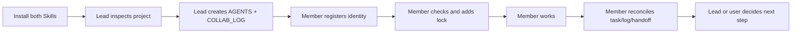

# Remote Agent Collaboration Lite

If you are vibe coding with friends, cofounders, contractors, or several AI agents, this is the lightweight coordination layer you want before the repo turns into scattered chats and duplicate edits.

Remote Agent Collaboration Lite gives your small team two Markdown Skills, Lead and Member, plus shared project files for actor identity, soft locks, logs, optional tasks, and optional module boundaries. No server, no database, no CLI, no hooks.

Install both Skills. Use one role per thread.

- `team-lead-collaboration`
- `team-member-collaboration`

Start one Lead thread:

```text
$team-lead-collaboration Set up lightweight collaboration for this project.
```

Start Member threads:

```text
$team-member-collaboration Work on my assigned scope and update the shared collaboration log.
```



## 60-Second Install

Install both Skills. Use one role per thread.

This repository ships plain Skill folders. The tested install path is file copy. The current local Codex CLI has plugin commands, but no verified non-interactive Skill install/list command for these standalone folders, so this README does not claim a marketplace install path.

### Copy-paste prompt for an AI Agent

```text
Install both Remote Agent Collaboration Lite Skills from this repository by copying:
- skills/team-lead-collaboration
- skills/team-member-collaboration

Use the user-level Codex Skills folder when available:
~/.codex/skills

After installation, verify both Skills are visible:
- team-lead-collaboration
- team-member-collaboration

Then start a fresh thread and activate exactly one role with either:
$team-lead-collaboration
or:
$team-member-collaboration

Do not activate the other role in the same thread.
```

### User-level install

Run these commands from the repository root.

Windows PowerShell:

```powershell
$skills = Join-Path $env:USERPROFILE ".codex\skills"
New-Item -ItemType Directory -Force $skills | Out-Null
Copy-Item -Recurse -Force .\skills\team-lead-collaboration (Join-Path $skills "team-lead-collaboration")
Copy-Item -Recurse -Force .\skills\team-member-collaboration (Join-Path $skills "team-member-collaboration")
Get-ChildItem $skills | Where-Object Name -in @("team-lead-collaboration", "team-member-collaboration")
```

macOS/Linux shell:

```bash
mkdir -p "$HOME/.codex/skills"
cp -R skills/team-lead-collaboration "$HOME/.codex/skills/team-lead-collaboration"
cp -R skills/team-member-collaboration "$HOME/.codex/skills/team-member-collaboration"
find "$HOME/.codex/skills" -maxdepth 1 -type d \( -name team-lead-collaboration -o -name team-member-collaboration \)
```

### Project-level install

Use this when you want to vendor the Skills into a project repository for repeatable setup. Copy them into a project-local folder, then copy or symlink them into each agent's actual Skill directory if that environment does not auto-discover project-local Skills.

Windows PowerShell:

```powershell
New-Item -ItemType Directory -Force .\.codex\skills | Out-Null
Copy-Item -Recurse -Force .\skills\team-lead-collaboration .\.codex\skills\team-lead-collaboration
Copy-Item -Recurse -Force .\skills\team-member-collaboration .\.codex\skills\team-member-collaboration
Get-ChildItem .\.codex\skills
```

macOS/Linux shell:

```bash
mkdir -p .codex/skills
cp -R skills/team-lead-collaboration .codex/skills/team-lead-collaboration
cp -R skills/team-member-collaboration .codex/skills/team-member-collaboration
find .codex/skills -maxdepth 1 -type d
```

Installed directory shape:

```text
.codex/skills/
  team-lead-collaboration/
    SKILL.md
    references/
      AGENTS.template.md
      COLLAB_LOG.template.md
      TEAM_TASKS.template.md
      MODULE_OWNERSHIP.template.md
  team-member-collaboration/
    SKILL.md
```

Verify both Skills are visible in your AI coding environment's Skill picker or model-visible Skill list:

- `team-lead-collaboration`
- `team-member-collaboration`

## What This Is

Remote Agent Collaboration Lite is a Markdown-only collaboration workflow for one project lead and multiple contributors. Contributors can be humans, Codex threads, Claude threads, other AI agents, or a mix of all of them.

It does not try to enforce permissions. It gives agents explicit instructions to read the same project files, claim work before editing, avoid conflicting scopes, and leave short handoff notes.

Use it when:

- A small team or tiny company is building in one repository.
- Several AI threads may edit related files.
- You want a lead agent to coordinate work without introducing infrastructure.
- You need lightweight logs and soft locks instead of a full project management system.
- You want a new contributor to understand the collaboration rules in five minutes.

## Core Files

| File | Required | Purpose |
| --- | --- | --- |
| `AGENTS.md` | Yes | Shared project rules, Actor Registry, startup checklist, Git rules, logging rules, and conflict handling. |
| `COLLAB_LOG.md` | Yes | Active locks, Current Snapshot, blockers, Open Handoffs, decisions, updates, and history. |
| `TEAM_TASKS.md` | Optional | Lightweight task blocks when Task Assignment Mode is enabled. |
| `MODULE_OWNERSHIP.md` | Optional | Module owners and path boundaries when Module Ownership Mode is enabled. |

Templates are available in [`templates/`](templates/). The Lead Skill also carries identical self-contained templates in [`skills/team-lead-collaboration/references/`](skills/team-lead-collaboration/references/).

## Actor Identity Protocol

Every Lead, Member, lock, task, update, decision, and handoff should use a stable actor identity.

Required fields:

- Human owner:
- Agent platform:
- Collaboration role:
- Functional role:
- Instance:
- Actor ID:
- Display name:

Example:

```yaml
human_owner: Gary
agent_platform: Codex
collaboration_role: Member
functional_role: Frontend Developer
instance: 01
actor_id: gary-codex-member-frontend-01
display_name: Gary's Codex #01 (Member - Frontend Developer)
```

Rules:

- Lead Skill means `Collaboration role: Lead`.
- Member Skill means `Collaboration role: Member`.
- Do not ask again whether the actor is Lead or Member.
- If the human owner is unknown, ask the user.
- If the agent platform cannot be determined reliably, ask the user.
- If the functional role is unclear, ask the user.
- Do not use a task name as actor identity.
- Keep `actor_id` stable across `AGENTS.md`, `COLLAB_LOG.md`, `TEAM_TASKS.md`, and `MODULE_OWNERSHIP.md`.

## Quick Start

1. Install both Skills.
2. Start a Lead thread:

   ```text
   $team-lead-collaboration Initialize collaboration for this existing project.
   ```

3. The Lead checks whether the project is empty or already has structure.
4. The Lead confirms actor identity and registers it in `AGENTS.md`.
5. The Lead creates or updates `AGENTS.md` and `COLLAB_LOG.md`.
6. The Lead asks whether to enable Task Assignment Mode.
7. If task mode is enabled, the Lead asks: "Who may mark tasks DONE?"
8. The Lead asks whether to enable Module Ownership Mode.
9. Start one or more Member threads:

   ```text
   $team-member-collaboration Read the collaboration files and work on the scope I give you.
   ```

10. Each Member confirms identity, checks Active Work Locks, adds a lock when safe, removes it when done, and runs Final Reconciliation.

## Active Work Locks

`COLLAB_LOG.md` must keep Active Work Locks near the top.

A lock is a soft coordination note:

```markdown
- Actor ID:
  Display Name:
  Collaboration Role: Lead | Member
  Functional Role:
  Status: reading | writing | paused
  Scope:
  Task:
  Started:
  Last Updated:
  Expected Finish:
  Notes:
```

Use repository-relative paths for Scope. Prefer concrete files or directories. Do not record local absolute paths.

Conflict semantics:

- reading with reading does not conflict by default.
- writing with overlapping writing is a conflict.
- reading with overlapping writing requires a warning.
- If reading is only observation, it may continue.
- If reading is likely to become editing soon, ask first or switch scope.
- paused still reserves the scope.
- stale threshold: 2 hours unless `AGENTS.md` overrides it.
- Do not remove another actor's stale lock without user or Lead confirmation.

Before larger work, read the latest `COLLAB_LOG.md`, check locks, add your own lock if safe, then double-check Active Work Locks after writing your own lock. Markdown soft locks are not atomic. If a race appears, stop before editing business files and ask the user or Lead.

## Current Snapshot And Open Handoffs

`COLLAB_LOG.md` uses Current Snapshot instead of stale summaries:

- Stage:
- Current focus:
- Active work:
- Next action:
- Last updated:
- Updated by:

Open Handoffs only contains unresolved handoffs:

- `open`
- `accepted`

Move `resolved` and `cancelled` handoffs to History / Archived Notes.

When a Member completes `TASK-001` and marks it `READY_FOR_REVIEW`:

- Active Work Locks no longer keeps that Member's writing lock.
- Current Snapshot says `Next action: Lead or user reviews TASK-001.`
- Open Handoffs keeps only the Member to Lead/User review handoff.
- No old Lead to Member handoff asks that Member to retake the completed task.
- Latest Updates records the completion.
- `TEAM_TASKS.md` status is `READY_FOR_REVIEW`.

## Final Reconciliation

Both Skills must reconcile state after major work:

- Active Work Locks match the real state.
- TEAM_TASKS.md status matches the real state.
- Current Snapshot reflects the latest work.
- Open Handoffs only contain unresolved items.
- Recent Decisions match the current mode.
- `actor_id` is consistent across collaboration files.
- Timestamps use the project timezone and UTC offset.
- Files do not contradict each other.

## Git Rules

The Skills do not assume every project has Git or a remote.

Start with:

```bash
git rev-parse --is-inside-work-tree
```

If it is not a Git repository, tell the user, ask whether to initialize Git, continue Markdown collaboration setup if Git is not needed, and do not run `git fetch`.

If it is a Git repository, run:

```bash
git status --short --branch
git branch -vv
```

Only run `git fetch --all --prune` when a remote exists. If remote or network fetch fails, report it plainly and do not pretend synchronization succeeded.

## Modes

Casual Coordination Mode is the default. It uses only:

- `AGENTS.md`
- `COLLAB_LOG.md`

Task Assignment Mode is optional. When enabled, `TEAM_TASKS.md` uses:

- `BACKLOG`
- `ASSIGNED`
- `IN_PROGRESS`
- `BLOCKED`
- `READY_FOR_REVIEW`
- `CHANGES_REQUESTED`
- `DONE`

Module Ownership Mode is optional. If the user does not want module ownership, do not create `MODULE_OWNERSHIP.md`.

## Example Tiny Team Flow

See [`examples/tiny-team-project`](examples/tiny-team-project/).

The example shows:

- Alex's Codex #01 acting as Lead.
- Morgan's Claude #01 acting as Member for content.
- Alex's Codex #02 acting as a second Member for testing.
- Task Assignment Mode enabled.
- Module Ownership Mode not enabled yet.
- One Member adding a lock.
- A second Member detecting an overlapping lock and stopping before editing.
- The first Member completing work, removing the lock, and moving `TASK-001` to `READY_FOR_REVIEW`.
- Current Snapshot and Open Handoffs staying consistent with the task state.

## Limitations

- This is a soft coordination workflow.
- It does not enforce OS-level permissions.
- It does not prevent someone from ignoring the rules.
- It works because agents are instructed to read and follow shared Markdown files.
- It is intentionally not a server, database, CLI, hook system, or enterprise permission model.

## Version

Current Lite protocol version: `0.3.0`.

## Advanced Branches

Advanced local protocol experiments are preserved on the `standard-local-protocol` branch.

## Chinese

See [README.zh-CN.md](README.zh-CN.md).
