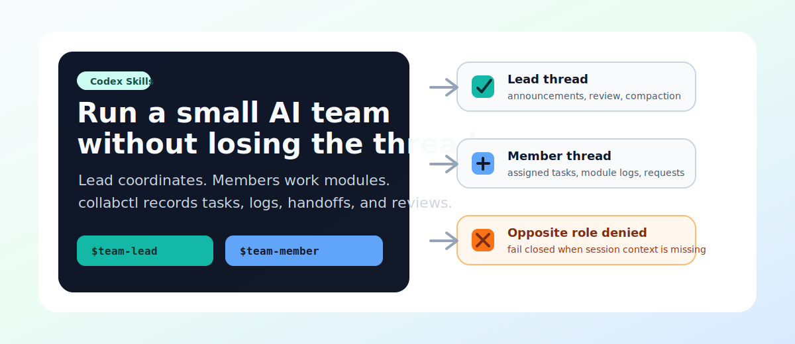
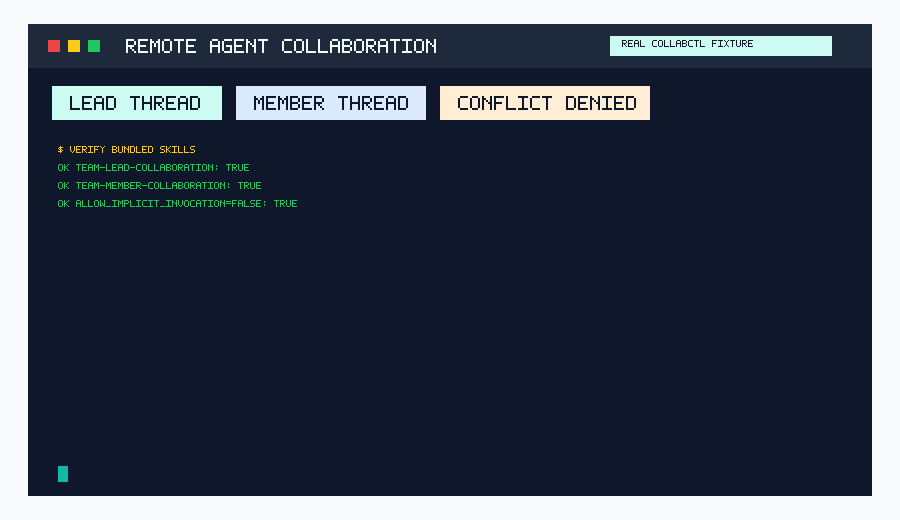
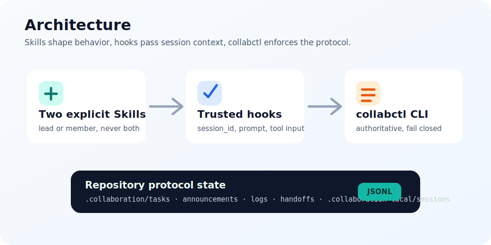
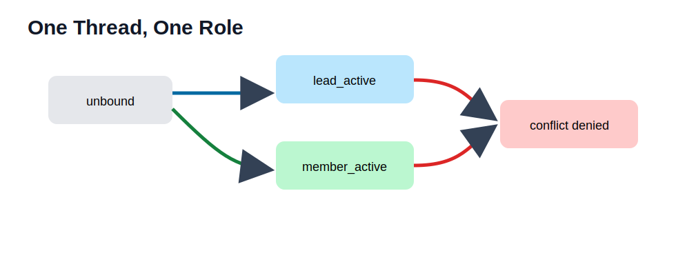

<p align="center">
  
</p>

# Remote Agent Collaboration Skills

Install both Skills. Activate exactly one per Codex thread.



Remote Agent Collaboration packages two explicit Codex Skills and a deterministic CLI for teams where humans and AI agents share one repository. The lead role governs collaboration; the member role works inside assigned modules.

> Current local validation status: **FAILED CORE GATE** in this development environment. `collabctl` fails closed for role-controlled writes without a real `session_id`, and `doctor` will not report healthy until hooks are trusted and observed running in real Codex threads.

## For AI Agents: Install Both Skills, Activate One Role

Use this section without reading the full README.

1. Add the marketplace:

   ```bash
   codex plugin marketplace add Gary06868/remote-agent-collaboration-skills
   ```

2. Open `/plugins` and install **Remote Agent Collaboration**.
3. Verify both Skills are installed and distinct:
   - `team-lead-collaboration`
   - `team-member-collaboration`
4. Open `/hooks`, review, and trust the plugin hooks.
5. Start a new Codex thread.
6. Activate exactly one role:

   ```text
   $team-lead-collaboration Initialize and govern collaboration for this project as the registered lead actor.
   ```

   or:

   ```text
   $team-member-collaboration Read current announcements, accept my assigned task, and work only inside my authorized module.
   ```

7. Do not call the other role in the same thread.
8. Run:

   ```bash
   collabctl doctor --json
   ```

9. Report installed paths, plugin status, hook status, and `role_lock_enforced`.

Copyable agent instruction:

```text
Install the remote-agent-collaboration plugin from Gary06868/remote-agent-collaboration-skills. Install both bundled Skills. Do not activate either role during installation. Open /hooks, review and trust hooks, start a new Codex thread, choose exactly one role with $team-lead-collaboration or $team-member-collaboration, run collabctl doctor --json, and report plugin status, hook status, installed paths, and role_lock_enforced.
```

Current CLI note: this machine's `codex-cli 0.130.0-alpha.5` exposes `codex plugin marketplace add|upgrade|remove` and interactive `/plugins`; it does not expose `codex plugin add --json` or `codex plugin list --json`. Documentation must be updated if a newer CLI adds tested non-interactive install/list commands.

## Quick Start

```bash
python -m pip install -e .
collabctl init --project-id demo --yes
collabctl actor bootstrap --actor-id lead --role lead --yes
collabctl session activate --session-id thread-lead --role lead --skill team-lead-collaboration --actor-id lead
collabctl doctor --json
```

`doctor` reports unhealthy until real Codex hooks are trusted and observed.

## Role Model

| Role | Skill | Can Do | Cannot Do |
| --- | --- | --- | --- |
| Lead | `$team-lead-collaboration` | Manage members, modules, tasks, announcements, reviews, log compaction | Silently switch to member |
| Member | `$team-member-collaboration` | Work assigned tasks, acknowledge announcements, append authorized module logs, create requests | Approve own work, compact logs, mutate policy, switch to lead |

## Architecture





Hooks are guardrails. `collabctl` is the deterministic enforcement layer and fails closed without session context.

## Rebuild Demo

```bash
python scripts/generate_demo.py
python scripts/verify_readme_assets.py
```

The demo uses a reproducible `collabctl` transcript fixture and does not fake Codex UI screenshots.

## Security

See [SECURITY.md](SECURITY.md). Hooks and file permissions are not an OS sandbox or cryptographic boundary.

## Chinese

See [README.zh-CN.md](README.zh-CN.md).
