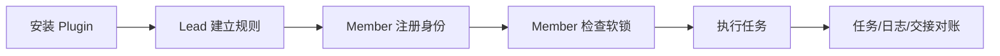

# Remote Agent Collaboration Lite

如果你正在和朋友、合伙人、外包同伴或多个 AI Agent 一起 vibe coding，在仓库变成散乱聊天记录和重复修改之前，先用这个轻量协作层。

Remote Agent Collaboration Lite 提供两个 Markdown Skill：Lead（协调者）和 Member（执行者），再加几个共享项目文件，用来记录 actor identity、soft lock、日志、可选任务和可选模块边界。

不需要服务器、不需要数据库、不需要 hooks，也不需要自定义协作 CLI。
只有 Markdown 文件和可选 Git。

如果这个项目帮到了你的 AI coding 工作流，给 GitHub 仓库点一颗 star 可以帮助更多人发现它。

同时安装两个 Skill。每个 thread 只使用一个角色。

- `team-lead-collaboration`
- `team-member-collaboration`

开启 Lead thread：

```text
$team-lead-collaboration Set up lightweight collaboration for this project.
```

开启 Member thread：

```text
$team-member-collaboration Work on my assigned scope and update the shared collaboration log.
```



## Install

### Option 1 - Codex Plugin（首选）

Plugin name: `remote-agent-collaboration-lite`
Plugin display name: `Remote Agent Collaboration Lite`
Marketplace name: `remote-agent-collaboration-lite`
Version: `0.5.0`

添加这个仓库 marketplace：

```powershell
codex plugin marketplace add Gary06868/remote-agent-collaboration-skills
```

添加 marketplace 不等于已经安装 Plugin。

安装步骤：

1. 打开 `/plugins`。
2. 选择 `Remote Agent Collaboration Lite` marketplace。
3. 安装 `Remote Agent Collaboration Lite`。
4. 新建 Codex thread。
5. 验证两个 Skill 都可见：
   - `team-lead-collaboration`
   - `team-member-collaboration`
6. 在该 thread 中只激活一个角色。

README 使用 `/plugins` 完成 Plugin 安装。除非某个非交互式安装命令已经对本仓库验证通过，否则这里不列为安装路径。

更新：

```powershell
codex plugin marketplace upgrade remote-agent-collaboration-lite
```

移除 marketplace：

```powershell
codex plugin marketplace remove remote-agent-collaboration-lite
```

卸载或禁用 Plugin 不应删除项目里的 `AGENTS.md`、`COLLAB_LOG.md`、`TEAM_TASKS.md`、`MODULE_OWNERSHIP.md` 或 `.collab/`。

### Option 2 - Built-in Skill Installer

内置 `$skill-installer` 可以作为本地兜底思路，但当前仓库还没有把它发布为已验证安装路径。优先使用上面的 Plugin；开发和恢复场景使用下面的手动复制。

### Option 3 - Manual Copy

用于开发、本地恢复或不支持 Plugin 的环境。当前 Codex Skills 文档使用 `.agents/skills` 作为仓库级和用户级 Skill 扫描路径。

Windows PowerShell：

```powershell
$skills = Join-Path $env:USERPROFILE ".agents\skills"
New-Item -ItemType Directory -Force $skills | Out-Null
Remove-Item -Recurse -Force (Join-Path $skills "team-lead-collaboration") -ErrorAction SilentlyContinue
Remove-Item -Recurse -Force (Join-Path $skills "team-member-collaboration") -ErrorAction SilentlyContinue
Copy-Item -Recurse -Force .\skills\team-lead-collaboration (Join-Path $skills "team-lead-collaboration")
Copy-Item -Recurse -Force .\skills\team-member-collaboration (Join-Path $skills "team-member-collaboration")
Get-ChildItem $skills | Where-Object Name -in @("team-lead-collaboration", "team-member-collaboration")
```

macOS/Linux shell：

```bash
mkdir -p "$HOME/.agents/skills"
rm -rf "$HOME/.agents/skills/team-lead-collaboration"
rm -rf "$HOME/.agents/skills/team-member-collaboration"
cp -R skills/team-lead-collaboration "$HOME/.agents/skills/team-lead-collaboration"
cp -R skills/team-member-collaboration "$HOME/.agents/skills/team-member-collaboration"
find "$HOME/.agents/skills" -maxdepth 1 -type d \( -name team-lead-collaboration -o -name team-member-collaboration \)
```

这些命令 safe to run repeatedly：只删除并重装这两个目标 Skill 目录，不会覆盖其他 Skill。

项目级安装使用 `<PROJECT_ROOT>/.agents/skills` 和同样的两个目标目录。详见 [docs/INSTALLATION.md](docs/INSTALLATION.md)。

验证两个 Skill 都可见：

- `team-lead-collaboration`
- `team-member-collaboration`

## 给 AI Agent：安装 Plugin 并验证两个 Skill

把这段指令复制给新 Agent：

```text
Install the Remote Agent Collaboration Lite Plugin from:
Gary06868/remote-agent-collaboration-skills

Use this verified marketplace step first:
codex plugin marketplace add Gary06868/remote-agent-collaboration-skills

Then open /plugins and install:
Remote Agent Collaboration Lite

Requirements:
- Install one Plugin that bundles both Skills.
- Verify these two Skills are separately visible:
  - team-lead-collaboration
  - team-member-collaboration
- Do not merge the Skills.
- Do not install hooks.
- Do not install a custom collaboration CLI.
- Start a fresh thread.
- Activate exactly one role in that thread:
  $team-lead-collaboration
  or:
  $team-member-collaboration
- Do not activate the other role in the same thread.
- Report Plugin version 0.5.0, Plugin name remote-agent-collaboration-lite, marketplace name remote-agent-collaboration-lite, and both visible Skill names.
```

## 这是什么

Remote Agent Collaboration Lite 是一个纯 Markdown 协作流程，适合一个项目 Lead 和多个贡献者共同工作。贡献者可以是真人、Codex thread、Claude thread、其他 AI Agent，或它们的组合。

它不是权限系统。它让 Agent 明确读取同一组项目文件，编辑前声明工作范围，避免冲突，并在完成后留下简短交接记录。

适合这些情况：

- 小团队或小公司在同一个仓库里开发。
- 多个 AI thread 可能修改相关文件。
- 你希望有一个 Lead Agent 负责协调，但不想引入基础设施。
- 你需要轻量日志和软锁，而不是完整项目管理系统。
- 你希望新成员 5 分钟内理解协作规则。

## 核心文件

| 文件 | 必需 | 用途 |
| --- | --- | --- |
| `AGENTS.md` | 是 | 共享项目规则、Actor Registry、启动检查、Git 规则、日志规则和冲突处理。 |
| `COLLAB_LOG.md` | 是 | 当前软锁、Current Snapshot、阻塞、Open Handoffs、决策、更新和历史。 |
| `TEAM_TASKS.md` | 可选 | 启用 Task Assignment Mode 时使用的轻量任务块。 |
| `MODULE_OWNERSHIP.md` | 可选 | 启用 Module Ownership Mode 时记录 owner 和路径边界。 |

模板在 [`templates/`](templates/)。Lead Skill 也在 [`skills/team-lead-collaboration/references/`](skills/team-lead-collaboration/references/) 内自带相同模板。

## Workspace Topology

先选择 Workspace Topology。它回答 Agent 在哪里工作，不回答团队使用哪种任务流程。

Shared Workspace Mode 适合同一个工作目录里的多个 Agent，也就是 same working directory。它们通过根目录 Markdown 文件协作，使用本地 Active Work Locks，并在写入自己的锁后 double-check Active Work Locks after writing your own lock，再修改业务文件。

Remote Git Mode (Beta) 适合 different machines, clones, or worktrees 通过 Git remote 协作。Do not mix assumptions between these modes. Git 只是同步传输机制，不是权限服务、锁服务器或常驻进程。

Remote Git Mode 使用低冲突 Markdown 状态：`.collab/locks/<actor-id>.md`、`.collab/tasks/<task-id>.md`、`.collab/events/<timestamp>-<actor-id>.md`、`.collab/snapshots/COLLAB_LOG.md` 和 `COLLAB_LOG.md`。这些文件分别承担 authoritative state、append-only event 和 derived snapshot，Lead may rebuild 其中的聚合快照。

完整 Remote Git Mode Lock Protocol 见 [docs/REMOTE_GIT_MODE.md](docs/REMOTE_GIT_MODE.md)，包括 fetch the latest remote state、create a candidate lock record、commit only the candidate lock、push the candidate lock、non-fast-forward 恢复、fetch, rebase or reapply the candidate lock, re-read all locks, and re-evaluate scope overlap。Do not force push。Only edit business files after the candidate lock is published and rechecked on the latest remote state。生命周期术语是 acquire、refresh、pause、resume、release、stale、abandoned。

## Workflow Options

Casual Coordination Mode 是默认模式，只使用 `AGENTS.md` 和 `COLLAB_LOG.md`。Task Assignment Mode 是可选模式，会添加 `TEAM_TASKS.md`。Module Ownership Mode 也是可选模式，只有用户需要模块边界时才添加 `MODULE_OWNERSHIP.md`。

Workflow Options 独立于 Workspace Topology。比如，一个团队可以在 Shared Workspace Mode 或 Remote Git Mode (Beta) 中使用 Task Assignment Mode。

## 协议摘要

Actor identity 字段在所有协作文件中保持稳定：

- Human owner:
- Agent platform:
- Collaboration role:
- Functional role:
- Instance:
- Actor ID:
- Display name:

## Actor Status Semantics

`active`: the actor may accept work and acquire, refresh, pause, resume, and release locks. `paused`: the actor is temporarily unavailable for new scope. `retired`: the actor no longer accepts new work and must not hold an active lock. Allowed transitions: active -> paused -> active, active -> retired, paused -> retired. A Member may update only its own Actor Registry entry. `Last seen` updates when the actor starts work, acquires a lock, refreshes a lock, pauses, resumes, releases, changes task status, creates a handoff, or responds to a handoff. `Current scope` updates when the actor acquires, pauses, resumes, or releases a lock, or when assigned task scope changes.

Active Work Locks 格式：

```markdown
- Actor ID:
  Display Name:
  Collaboration Role: Lead | Member
  Functional Role:
  Status: reading | writing | paused
  Scope:
  Task:
  Started:
  Last Updated:
  Expected Finish:
  Notes:
```

冲突语义：reading with reading does not conflict by default；writing with overlapping writing is a conflict；reading with overlapping writing requires a warning；paused still reserves the scope；stale threshold: 2 hours，除非 `AGENTS.md` 覆盖。Do not remove another actor's stale lock without user or Lead confirmation.

## Scope Canonicalization

Use repository-relative paths only. Use `/` as the separator. Remove a leading `./`. Collapse repeated `/` characters. Remove trailing `/` except for repository root. Separate multiple paths with `;`. Trim whitespace around each path. Reject absolute paths. Reject `..` path segments. Scopes overlap when any canonical path is equal, parent/child, or shares a declared module/interface boundary.

Final Reconciliation 会在重要工作后对齐 Active Work Locks、TEAM_TASKS.md status、Current Snapshot、Open Handoffs、Recent Decisions、actor_id consistency、timestamps 和文件之间的状态。

Completion Policy 选项包括 Lead review、User review、Member self-completion、Per-task decision。review 修改循环必须明确：`CHANGES_REQUESTED -> IN_PROGRESS -> READY_FOR_REVIEW`，如果是自完成策略则为 `CHANGES_REQUESTED -> IN_PROGRESS -> DONE`。

完整协议见 [docs/PROTOCOL_REFERENCE.md](docs/PROTOCOL_REFERENCE.md)。

## 快速开始

1. 通过 Plugin 安装两个 Skill。
2. 用 `$team-lead-collaboration` 启动 Lead thread。
3. Lead 判断项目是空项目还是已有项目，确认 actor identity，创建或更新 `AGENTS.md` 和 `COLLAB_LOG.md`，询问是否启用 Task Assignment Mode，询问 "Who may mark tasks DONE?"，并询问是否启用 Module Ownership Mode。
4. 用 `$team-member-collaboration` 启动一个或多个 Member thread。
5. 每个 Member 确认身份、检查 Active Work Locks、无冲突时加锁、完成后移除锁并执行 Final Reconciliation。

## Tiny Team 示例

见 [`examples/tiny-team-project`](examples/tiny-team-project/)。

示例展示 Task Assignment Mode enabled、Module Ownership Mode not enabled yet、一个 Member 加锁、第二个 Member 发现 overlapping lock 并 stopped before editing、READY_FOR_REVIEW 交接，以及 Current Snapshot/Open Handoffs 一致性。

## 为什么用 Plugin？

Markdown Skill 内容保持简单。Plugin 只负责把两个 Skill 打包和分发成一个可安装产品，并提供图标元数据和版本管理。This repository follows the same general distribution idea used by multi-Skill Codex Plugins: package several Markdown Skills as one installable product.

## Codex 和 Claude 兼容性

这两个 Skill 都是普通 Markdown 文件夹。Codex 可以通过 Skill 系统使用它们。Claude 或其他 AI Agent 如果没有原生 Skill 选择界面，也可以直接读取同一份 `SKILL.md` 作为项目指令。无论使用哪个 Agent，协作状态文件都仍然是普通 Markdown。

## 限制

- 这是软协作流程。
- 它不执行操作系统级权限。
- 它不能阻止某个人或某个 Agent 忽略规则。
- 它依赖 Agent 读取并遵守共享 Markdown 文件。
- 它有意不是服务器、数据库、自定义协作 CLI、hook 系统或企业权限模型。

## 版本

当前 Lite 协议版本：`0.5.0`。

Advanced local protocol experiments are preserved on the `standard-local-protocol` branch.

## 更多文档

- [安装说明](docs/INSTALLATION.md)
- [协议参考](docs/PROTOCOL_REFERENCE.md)
- [Remote Git Mode](docs/REMOTE_GIT_MODE.md)
- [Codex Plugin Distribution Audit](docs/CODEX_PLUGIN_DISTRIBUTION_AUDIT.md)
- [Promotion Kit](docs/PROMOTION_KIT.md)
- [English README](README.md)
