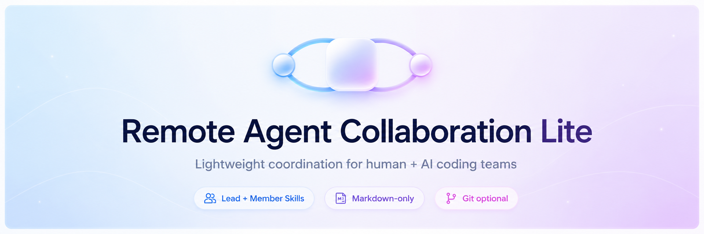
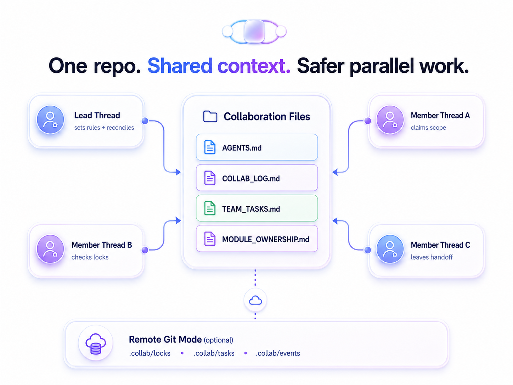
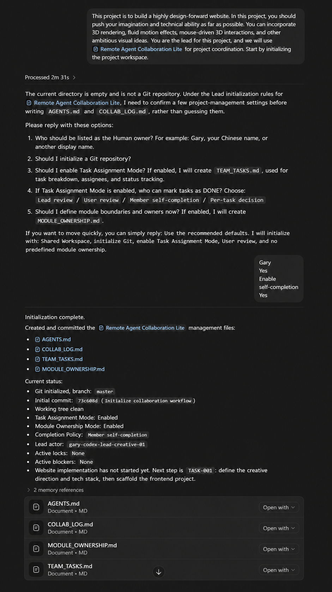

<p align="center">
  
</p>

<h1 align="center">Remote Agent Collaboration Lite</h1>

<p align="center"><strong>轻量协作层，服务人类 + AI 编码团队。</strong></p>

<p align="center">
在同一个仓库里协调 Lead 和 Member agent，减少重复修改、协作漂移和所有权不清。
</p>

<p align="center">
Codex Plugin 是一等支持 · Claude Code 通过 adapter 支持 · 通用 Agent 可通过共享指令兼容。
</p>

<p align="center">
  
  
  
  
  
  
  
</p>

<p align="center">
  <a href="#30-秒快速开始">Quick Start</a> ·
  <a href="#install">Installation</a> ·
  <a href="adapters/claude-code/">Claude Code Adapter</a> ·
  <a href="docs/REMOTE_GIT_MODE.md">Remote Git Mode</a> ·
  <a href="docs/PROTOCOL_REFERENCE.md">Protocol</a> ·
  <a href="README.md">English</a>
</p>

如果你正在和朋友、合伙人、外包伙伴或多个 AI Agent 一起 vibe coding，在仓库变成散乱聊天记录和重复修改之前，先用这个轻量协作层。

不需要服务器、不需要数据库、不需要 hooks，也不需要自定义协作 CLI。只有 Markdown 文件和可选 Git。

同时安装两个 Skill。每个 thread 只使用一个角色。

- `team-lead-collaboration`
- `team-member-collaboration`

## 它是什么

Remote Agent Collaboration Lite 是面向人类 + AI 编码团队的轻量协作层。它提供两个 Markdown Skill：Lead 和 Member，再加上一组共享项目文件，用来记录 actor identity、软锁、日志、可选任务和可选模块边界。

它不是权限系统。它让人类和 Agent 共享同一套操作界面：读取同一批协作文件，编辑前声明 scope，遇到重叠软锁时停止，并在状态变化时留下简短 update 或 handoff。



## 为什么使用

适合这些情况：

- 小团队或小公司在同一个仓库里开发。
- 多个 Codex、Claude Code 或通用 AI thread 可能修改相关文件。
- 你希望有一个 Lead Agent 负责协调，但不想引入基础设施。
- 你需要轻量日志和软锁，而不是完整项目管理系统。
- 你希望新人类成员或新 AI 贡献者快速理解 ownership 和 next action。

实际价值很直接：减少重复修改，减少只存在于聊天里的过期决策，让所有权和交接更清楚。

## 兼容矩阵

| Agent / Environment | Support Level | Recommended Path |
| --- | --- | --- |
| Codex | 一等支持 | Plugin |
| Claude Code | 支持 | Claude adapter |
| 通用 AI agents | 兼容 | 复制 prompt / 共享指令 |
| 人类贡献者 | 支持 | 共享协作文件 |

Codex and Claude compatibility 是明确支持，但路径不同。Codex 使用打包好的 Plugin 和 Skills。Claude Code 使用 [Claude Code adapter](adapters/claude-code/) 和项目规则文件。通用 Agent 可以阅读同样的 Markdown 指令，但本项目不会虚构每个 Agent 环境都有原生支持。

## 30 秒快速开始

```powershell
codex plugin marketplace add Gary06868/remote-agent-collaboration-skills
```

1. 打开 `/plugins`。
2. 安装 `Remote Agent Collaboration Lite`。
3. 开启一个 Lead thread：

   ```text
   $team-lead-collaboration Set up lightweight collaboration for this project.
   ```

4. 开启一个或多个 Member thread：

   ```text
   $team-member-collaboration Work on my assigned scope and update the shared collaboration log.
   ```

5. Claude Code 用户：从 [Claude Code adapter](adapters/claude-code/) 开始。



## 选择协作模式

| 需求 | 模式 | 含义 |
| --- | --- | --- |
| 多个 Agent 使用同一个工作目录 | Shared Workspace Mode | 通过根目录 Markdown 文件协作，写入自己的 Active Work Lock 后二次检查。 |
| 多机器、多 clone 或 worktree | Remote Git Mode (Beta) | 使用 Git 作为同步传输机制，并使用低冲突 `.collab/` 文件。 |
| 只需要轻量协作 | Casual Coordination Mode | 只使用 `AGENTS.md` 和 `COLLAB_LOG.md`，不启用任务跟踪。 |
| 需要 Lead 分配和审查任务 | Task Assignment Mode | 增加 `TEAM_TASKS.md` 记录 owner、status、review 和 handoff。 |
| 需要明确路径或模块边界 | Module Ownership Mode | 增加 `MODULE_OWNERSHIP.md` 记录 owner、allowed paths、interfaces 和 risks。 |

Workspace Topology 回答 Agent 在哪里工作。Workflow Options 回答团队如何跟踪工作。Shared Workspace Mode means the same working directory. Remote Git Mode means different machines, clones, or worktrees. Do not mix assumptions between these modes.

## 冲突示例：Soft Lock 的价值

tiny-team 示例展示了软锁的实际价值：

1. Member A 声明 `README.md` 写入 scope。
2. Member B 编辑前读取 Active Work Locks。
3. Member B 检测到 scope overlap，停止业务文件修改。
4. Lead 对 Current Snapshot、Open Handoffs 和任务状态做 reconciliation。

规则刻意保持简单：reading with reading does not conflict by default；writing with overlapping writing is a conflict；reading with overlapping writing requires a warning；paused still reserves the scope；stale threshold: 2 hours，除非 `AGENTS.md` 覆盖。Do not remove another actor's stale lock without user or Lead confirmation.

完整示例见 [`examples/tiny-team-project`](examples/tiny-team-project/)。

## Install

### Option 1 - Codex Plugin（首选）

Plugin name: `remote-agent-collaboration-lite`
Plugin display name: `Remote Agent Collaboration Lite`
Marketplace name: `remote-agent-collaboration-lite`
Version: `0.5.0`

添加这个仓库 marketplace：

```powershell
codex plugin marketplace add Gary06868/remote-agent-collaboration-skills
```

添加 marketplace 不等于已经安装 Plugin。

安装步骤：

1. 打开 `/plugins`。
2. 选择 `Remote Agent Collaboration Lite` marketplace。
3. 安装 `Remote Agent Collaboration Lite`。
4. 新建 Codex thread。
5. 验证两个 Skill 都可见：
   - `team-lead-collaboration`
   - `team-member-collaboration`
6. 在该 thread 中只激活一个角色。

更新：

```powershell
codex plugin marketplace upgrade remote-agent-collaboration-lite
```

移除 marketplace：

```powershell
codex plugin marketplace remove remote-agent-collaboration-lite
```

卸载或禁用 Plugin 不应删除项目里的 `AGENTS.md`、`COLLAB_LOG.md`、`TEAM_TASKS.md`、`MODULE_OWNERSHIP.md` 或 `.collab/`。

### Option 2 - Built-in Skill Installer

内置 `$skill-installer` 可以作为支持该能力环境下的兜底思路，但当前仓库不把它作为主要验证路径。优先使用上面的 Plugin；开发和恢复场景使用下面的手动复制。

### Option 3 - Manual Copy

用于开发、本地恢复或不支持 Plugin 的环境。当前 Codex Skills 文档使用 `.agents/skills` 作为仓库级和用户级 Skill 扫描路径。

Windows PowerShell：

```powershell
$skills = Join-Path $env:USERPROFILE ".agents\skills"
New-Item -ItemType Directory -Force $skills | Out-Null
Remove-Item -Recurse -Force (Join-Path $skills "team-lead-collaboration") -ErrorAction SilentlyContinue
Remove-Item -Recurse -Force (Join-Path $skills "team-member-collaboration") -ErrorAction SilentlyContinue
Copy-Item -Recurse -Force .\skills\team-lead-collaboration (Join-Path $skills "team-lead-collaboration")
Copy-Item -Recurse -Force .\skills\team-member-collaboration (Join-Path $skills "team-member-collaboration")
Get-ChildItem $skills | Where-Object Name -in @("team-lead-collaboration", "team-member-collaboration")
```

macOS/Linux shell：

```bash
mkdir -p "$HOME/.agents/skills"
rm -rf "$HOME/.agents/skills/team-lead-collaboration"
rm -rf "$HOME/.agents/skills/team-member-collaboration"
cp -R skills/team-lead-collaboration "$HOME/.agents/skills/team-lead-collaboration"
cp -R skills/team-member-collaboration "$HOME/.agents/skills/team-member-collaboration"
find "$HOME/.agents/skills" -maxdepth 1 -type d \( -name team-lead-collaboration -o -name team-member-collaboration \)
```

这些命令可以重复执行：只删除并重装这两个目标 Skill 目录，不会覆盖其他 Skill。

项目级安装使用 `<PROJECT_ROOT>/.agents/skills` 和同样的两个目标目录。详见 [docs/INSTALLATION.md](docs/INSTALLATION.md)。

验证两个 Skill 都可见：

- `team-lead-collaboration`
- `team-member-collaboration`

## 给 AI Agent：安装 Plugin 并验证两个 Skill

把这段指令复制给新 Agent：

```text
Install the Remote Agent Collaboration Lite Plugin from:
Gary06868/remote-agent-collaboration-skills

Use this verified marketplace step first:
codex plugin marketplace add Gary06868/remote-agent-collaboration-skills

Then open /plugins and install:
Remote Agent Collaboration Lite

Requirements:
- Install one Plugin that bundles both Skills.
- Verify these two Skills are separately visible:
  - team-lead-collaboration
  - team-member-collaboration
- Do not merge the Skills.
- Do not install hooks.
- Do not install a custom collaboration CLI.
- Start a fresh thread.
- Activate exactly one role in that thread:
  $team-lead-collaboration
  or:
  $team-member-collaboration
- Do not activate the other role in the same thread.
- Report Plugin version 0.5.0, Plugin name remote-agent-collaboration-lite, marketplace name remote-agent-collaboration-lite, and both visible Skill names.
```

## 核心文件

| 文件 | 必需 | 用途 |
| --- | --- | --- |
| `AGENTS.md` | 是 | 共享项目规则、Actor Registry、启动检查、Git 规则、日志规则和冲突处理。 |
| `COLLAB_LOG.md` | 是 | 当前软锁、Current Snapshot、阻塞、Open Handoffs、决策、更新和历史。 |
| `TEAM_TASKS.md` | 可选 | 启用 Task Assignment Mode 时使用的轻量任务块。 |
| `MODULE_OWNERSHIP.md` | 可选 | 启用 Module Ownership Mode 时记录 owner 和路径边界。 |
| `.collab/` | 仅 Remote Git Mode | 多 clone 协作时使用的低冲突 locks、tasks、events 和派生 snapshot。 |

模板在 [`templates/`](templates/)。Lead Skill 也在 [`skills/team-lead-collaboration/references/`](skills/team-lead-collaboration/references/) 内自带相同模板。

## 更多文档

- [Installation](docs/INSTALLATION.md)
- [Protocol Reference](docs/PROTOCOL_REFERENCE.md)
- [Remote Git Mode](docs/REMOTE_GIT_MODE.md)
- [Claude Code Adapter](adapters/claude-code/)
- [Codex Plugin Distribution Audit](docs/CODEX_PLUGIN_DISTRIBUTION_AUDIT.md)
- [Promotion Kit](docs/PROMOTION_KIT.md)
- [English README](README.md)

## 限制

- 这是软协作流程，不是安全边界。
- 它不执行 OS 级权限控制。
- 它无法阻止参与者忽略规则。
- Git 在 Shared Workspace Mode 中是可选项，只有选择 Remote Git Mode (Beta) 时才需要作为同步机制。
- Claude Code 是 adapter-based support，不是 native Claude plugin。
- 通用 Agent 兼容意味着共享指令可读，不代表每个 Agent 环境都有原生集成。
- 它有意不是 server、database、custom collaboration CLI、hook system、MCP server、daemon 或企业权限系统。

Current Lite protocol version: `0.5.0`.

Advanced local protocol experiments are preserved on the `standard-local-protocol` branch.
