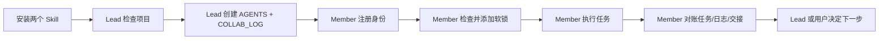

# Remote Agent Collaboration Lite

如果你正在和朋友、合伙人、外包同伴或多个 AI Agent 一起 vibe coding，在仓库变成散乱聊天记录和重复修改之前，先用这个轻量协作层。

Remote Agent Collaboration Lite 提供两个 Markdown Skill：Lead（协调者）和 Member（执行者），再加几个共享项目文件，用来记录 actor identity（行动者身份）、soft lock（软锁）、日志、可选任务和可选模块边界。不需要服务器、不需要数据库、不需要 CLI、不需要 hooks。

同时安装两个 Skill。每个 thread 只使用一个角色。

- `team-lead-collaboration`
- `team-member-collaboration`

开启一个 Lead thread：

```text
$team-lead-collaboration Set up lightweight collaboration for this project.
```

开启 Member thread：

```text
$team-member-collaboration Work on my assigned scope and update the shared collaboration log.
```



## 60 秒安装

同时安装两个 Skill。每个 thread 只使用一个角色。

这个仓库发布的是普通 Skill 文件夹。当前验证过的安装方式是文件复制。本机 Codex CLI 有 plugin 命令，但没有已验证的独立 Skill 非交互式安装/列表命令，所以这里不写未经测试的 marketplace 安装路径。

### 给 AI Agent 的可复制安装 Prompt

```text
从这个仓库安装两个 Remote Agent Collaboration Lite Skill，复制：
- skills/team-lead-collaboration
- skills/team-member-collaboration

优先使用用户级 Codex Skills 目录：
~/.codex/skills

安装后验证两个 Skill 都可见：
- team-lead-collaboration
- team-member-collaboration

然后新建 thread，并且只显式激活一个角色：
$team-lead-collaboration
或者：
$team-member-collaboration

不要在同一个 thread 激活另一个角色。
```

### 用户级安装

在仓库根目录执行。

Windows PowerShell:

```powershell
$skills = Join-Path $env:USERPROFILE ".codex\skills"
New-Item -ItemType Directory -Force $skills | Out-Null
Remove-Item -Recurse -Force (Join-Path $skills "team-lead-collaboration") -ErrorAction SilentlyContinue
Remove-Item -Recurse -Force (Join-Path $skills "team-member-collaboration") -ErrorAction SilentlyContinue
Copy-Item -Recurse -Force .\skills\team-lead-collaboration (Join-Path $skills "team-lead-collaboration")
Copy-Item -Recurse -Force .\skills\team-member-collaboration (Join-Path $skills "team-member-collaboration")
Get-ChildItem $skills | Where-Object Name -in @("team-lead-collaboration", "team-member-collaboration")
```

这些命令 safe to run repeatedly：它们只删除并重装这两个目标 Skill 目录，不会覆盖其他 Skill。

macOS/Linux shell:

```bash
mkdir -p "$HOME/.codex/skills"
rm -rf "$HOME/.codex/skills/team-lead-collaboration"
rm -rf "$HOME/.codex/skills/team-member-collaboration"
cp -R skills/team-lead-collaboration "$HOME/.codex/skills/team-lead-collaboration"
cp -R skills/team-member-collaboration "$HOME/.codex/skills/team-member-collaboration"
find "$HOME/.codex/skills" -maxdepth 1 -type d \( -name team-lead-collaboration -o -name team-member-collaboration \)
```

### 项目级安装

项目级安装适合把 Skill 随项目一起保存，方便团队重复安装。如果你的 AI 环境不会自动发现项目内 Skill，就再复制或链接到各自真实的 Skill 目录。

Windows PowerShell:

```powershell
New-Item -ItemType Directory -Force .\.codex\skills | Out-Null
Remove-Item -Recurse -Force .\.codex\skills\team-lead-collaboration -ErrorAction SilentlyContinue
Remove-Item -Recurse -Force .\.codex\skills\team-member-collaboration -ErrorAction SilentlyContinue
Copy-Item -Recurse -Force .\skills\team-lead-collaboration .\.codex\skills\team-lead-collaboration
Copy-Item -Recurse -Force .\skills\team-member-collaboration .\.codex\skills\team-member-collaboration
Get-ChildItem .\.codex\skills
```

macOS/Linux shell:

```bash
mkdir -p .codex/skills
rm -rf .codex/skills/team-lead-collaboration
rm -rf .codex/skills/team-member-collaboration
cp -R skills/team-lead-collaboration .codex/skills/team-lead-collaboration
cp -R skills/team-member-collaboration .codex/skills/team-member-collaboration
find .codex/skills -maxdepth 1 -type d
```

安装后的目录结构：

```text
.codex/skills/
  team-lead-collaboration/
    SKILL.md
    references/
      AGENTS.template.md
      COLLAB_LOG.template.md
      TEAM_TASKS.template.md
      MODULE_OWNERSHIP.template.md
  team-member-collaboration/
    SKILL.md
```

验证两个 Skill 都可见：在你的 AI coding 环境的 Skill 选择界面或模型可见 Skill 列表中确认：

- `team-lead-collaboration`
- `team-member-collaboration`

## 这是什么

Remote Agent Collaboration Lite 是一个纯 Markdown 协作流程，适合一个项目 Lead 和多个贡献者共同工作。贡献者可以是真人、Codex thread、Claude thread、其他 AI Agent，或它们的组合。

它不是权限系统。它让 Agent 明确读取同一组项目文件，编辑前声明工作范围，避免冲突，并在完成后留下简短交接记录。

适合这些情况：

- 小团队或小公司在同一个仓库里开发。
- 多个 AI thread 可能修改相关文件。
- 你希望有一个 Lead Agent 负责协调，但不想引入基础设施。
- 你需要轻量日志和软锁，而不是完整项目管理系统。
- 你希望新成员 5 分钟内理解协作规则。

## 核心文件

| 文件 | 必需 | 用途 |
| --- | --- | --- |
| `AGENTS.md` | 是 | 共享项目规则、Actor Registry（行动者登记表）、启动检查、Git 规则、日志规则和冲突处理。 |
| `COLLAB_LOG.md` | 是 | 当前软锁、Current Snapshot（当前快照）、阻塞、Open Handoffs（未解决交接）、决策、更新和历史。 |
| `TEAM_TASKS.md` | 可选 | 启用任务分配模式时使用的轻量任务块。 |
| `MODULE_OWNERSHIP.md` | 可选 | 启用模块边界模式时记录 owner 和路径边界。 |

模板在 [`templates/`](templates/)。Lead Skill 也在 [`skills/team-lead-collaboration/references/`](skills/team-lead-collaboration/references/) 内自带相同模板。

## 协作模式

Remote Agent Collaboration Lite 有两种明确模式。

### Shared Workspace Mode

Shared Workspace Mode 适合同一个工作目录里的多个 Agent。它们通过根目录 Markdown 文件协作，使用本地 Active Work Locks，并在写入自己的锁后 double-check Active Work Locks after writing your own lock，再修改业务文件。

### Remote Git Mode

Remote Git Mode 适合 different machines, clones, or worktrees 通过 Git remote 协作。Git 只是同步传输机制，不是权限服务、锁服务器或常驻进程。

Do not mix assumptions between these modes. Shared Workspace Mode 可以依赖 same working directory 和本地即时读取。Remote Git Mode 必须假设任何两条本地命令之间，另一个 clone 都可能已经 push 新状态。

Remote Git Mode 使用低冲突 Markdown 状态：

| 路径 | 类型 | 规则 |
| --- | --- | --- |
| `.collab/locks/<actor-id>.md` | authoritative state | 每个 actor 一个锁文件，记录该 actor 当前锁状态。 |
| `.collab/tasks/<task-id>.md` | authoritative state | 每个任务一个任务文件，记录状态、owner、scope、completion policy 和 review target。 |
| `.collab/events/<timestamp>-<actor-id>.md` | append-only event | 每个事件一个文件。不要重写旧事件文件，除非是分享前清理隐私。 |
| `.collab/snapshots/COLLAB_LOG.md` | derived snapshot | Lead may rebuild this from locks, tasks, and events. |
| `COLLAB_LOG.md` | derived snapshot | 在 Remote Git Mode 中，这是给人看的聚合快照，Lead may rebuild。 |

Remote Git Mode 以 `.collab/*` 为 source of truth。根目录文件继续方便人阅读，但低冲突文件能减少多个 Agent 同时重写 `COLLAB_LOG.md` 和 `TEAM_TASKS.md`。

## Remote Git Mode Lock Protocol

Remote Git Mode 中，修改业务文件之前：

1. fetch the latest remote state.
2. 重新读取 `.collab/locks/*.md` 和 `.collab/tasks/*.md`。
3. 检查现有锁是否 scope overlap。
4. create a candidate lock record 到 `.collab/locks/<actor-id>.md`。
5. commit only the candidate lock。
6. push the candidate lock 到协作分支。
7. 如果 push 遇到 non-fast-forward，fetch, rebase or reapply the candidate lock, re-read all locks, and re-evaluate scope overlap。
8. Do not blindly repeat push。
9. Do not force push。
10. Only edit business files after the candidate lock is published and rechecked on the latest remote state.

如果两个 actor 竞争同一 scope，只允许一个继续。失败方必须撤回 candidate lock，并在业务修改前停止。

锁生命周期：

- acquire：发布候选锁，复核最新远端状态，然后视为获得锁。
- refresh：长时间工作前更新 `Last Updated`。
- pause：临时停止但继续保留 scope。
- resume：同一 actor 返回并 refresh 后继续。
- release：完成和对账后移除或标记释放自己的锁。
- stale：超过 stale threshold；普通 Member 只能报告，不能删除。
- abandoned：Lead 或明确用户决策把 stale/crashed lock 标记为 abandoned，其他人才能继续。

## Actor Identity Protocol

所有 Lead、Member、软锁、任务、更新、决策和交接都应该使用稳定的 actor identity。

必需字段：

- Human owner:
- Agent platform:
- Collaboration role:
- Functional role:
- Instance:
- Actor ID:
- Display name:

示例：

```yaml
human_owner: Gary
agent_platform: Codex
collaboration_role: Member
functional_role: Frontend Developer
instance: 01
actor_id: gary-codex-member-frontend-01
display_name: Gary's Codex #01 (Member - Frontend Developer)
```

规则：

- 使用 Lead Skill 就表示 `Collaboration role: Lead`。
- 使用 Member Skill 就表示 `Collaboration role: Member`。
- 不要再询问 actor 是 Lead 还是 Member。
- 如果 human owner 未知，询问用户。
- 如果 agent platform 无法可靠判断，询问用户。
- 如果 functional role 不明确，询问用户。
- 不要用任务名称当 actor identity。
- 在 `AGENTS.md`、`COLLAB_LOG.md`、`TEAM_TASKS.md` 和 `MODULE_OWNERSHIP.md` 中保持 `actor_id` 一致。

## 快速开始

1. 安装两个 Skill。
2. 启动 Lead thread：

   ```text
   $team-lead-collaboration Initialize collaboration for this existing project.
   ```

3. Lead 判断项目是空项目还是已有项目。
4. Lead 确认 actor identity，并写入 `AGENTS.md`。
5. Lead 创建或更新 `AGENTS.md` 和 `COLLAB_LOG.md`。
6. Lead 询问是否启用 Task Assignment Mode（任务分配模式）。
7. 如果启用任务模式，Lead 询问："Who may mark tasks DONE?"
8. Lead 询问是否启用 Module Ownership Mode（模块边界模式）。
9. 启动一个或多个 Member thread：

   ```text
   $team-member-collaboration Read the collaboration files and work on the scope I give you.
   ```

10. 每个 Member 确认身份、检查 Active Work Locks，无冲突时添加软锁，完成后移除软锁并执行 Final Reconciliation（最终对账）。

## Active Work Locks

`COLLAB_LOG.md` 必须把 Active Work Locks 放在靠前位置。

软锁格式：

```markdown
- Actor ID:
  Display Name:
  Collaboration Role: Lead | Member
  Functional Role:
  Status: reading | writing | paused
  Scope:
  Task:
  Started:
  Last Updated:
  Expected Finish:
  Notes:
```

Scope 使用仓库相对路径。优先写具体文件或目录。不要记录本机绝对路径。

冲突语义：

- reading with reading does not conflict by default。
- writing with overlapping writing is a conflict。
- reading with overlapping writing requires a warning。
- 如果 reading 只是观察，可以继续。
- 如果 reading 很可能马上变成编辑，先询问或切换范围。
- paused still reserves the scope。
- stale threshold: 2 hours，除非 `AGENTS.md` 覆盖。
- Do not remove another actor's stale lock without user or Lead confirmation.

较大的工作开始前，读取最新 `COLLAB_LOG.md`，检查软锁，无冲突时添加自己的软锁，然后 double-check Active Work Locks after writing your own lock。Markdown 软锁不是原子锁，如果发现并发冲突，先停止，不要修改业务文件，等待用户或 Lead 决策。

## Current Snapshot 和 Open Handoffs

`COLLAB_LOG.md` 使用 Current Snapshot，避免旧摘要和最新状态矛盾：

- Stage:
- Current focus:
- Active work:
- Next action:
- Last updated:
- Updated by:

Open Handoffs 只保留未解决交接：

- `open`
- `accepted`

`resolved` 和 `cancelled` 移到 History / Archived Notes。

当 Member 完成 `TASK-001` 并标记为 `READY_FOR_REVIEW`：

- Active Work Locks 不再保留该 Member 的写锁。
- Current Snapshot 必须写清具体 review target。
- Open Handoffs 只保留 Member 到目标对象的 review 交接。
- 不再保留要求 Member 重新领取已完成任务的旧交接。
- Latest Updates 记录完成事实。
- `TEAM_TASKS.md` 状态为 `READY_FOR_REVIEW`。

Completion Policy 规则：

- Lead review：Member 完成后进入 `READY_FOR_REVIEW`；handoff target type 是 `actor`；target actor 是具体 Lead `actor_id`。
- User review：Member 完成后进入 `READY_FOR_REVIEW`；handoff target type 是 `human-user`；不要给用户伪造 Actor ID。
- Member self-completion：满足验收条件后直接进入 `DONE`；不创建 review handoff。
- Per-task decision：每个 task 必须记录 selected completion policy；缺失时停止并询问。

review 修改循环必须明确：`CHANGES_REQUESTED -> IN_PROGRESS -> READY_FOR_REVIEW`，如果是自完成策略则为 `CHANGES_REQUESTED -> IN_PROGRESS -> DONE`。

## Final Reconciliation

两个 Skill 完成重要工作后都要对账：

- Active Work Locks match the real state。
- TEAM_TASKS.md status matches the real state。
- Current Snapshot reflects the latest work。
- Open Handoffs only contain unresolved items。
- Recent Decisions 与当前模式一致。
- `actor_id` 在协作文件中一致。
- 时间戳使用项目时区和 UTC offset。
- 文件之间不存在互相矛盾的描述。

## Git 规则

Skill 不假设每个项目都有 Git 或 remote。

先运行：

```bash
git rev-parse --is-inside-work-tree
```

如果不是 Git 仓库，告诉用户，询问是否初始化 Git；如果不需要 Git，继续 Markdown 协作初始化；不要运行 `git fetch`。

如果是 Git 仓库，运行：

```bash
git status --short --branch
git branch -vv
```

只有存在 remote 时才运行 `git fetch --all --prune`。如果 remote 或网络 fetch 失败，明确报告，不要假装同步成功。

## 模式

Casual Coordination Mode（轻量协作模式）是默认模式，只使用：

- `AGENTS.md`
- `COLLAB_LOG.md`

Task Assignment Mode（任务分配模式）是可选模式，启用后 `TEAM_TASKS.md` 使用：

- `BACKLOG`
- `ASSIGNED`
- `IN_PROGRESS`
- `BLOCKED`
- `READY_FOR_REVIEW`
- `CHANGES_REQUESTED`
- `DONE`

Module Ownership Mode（模块边界模式）也是可选模式。如果用户暂时不需要，不创建 `MODULE_OWNERSHIP.md`。

## Tiny Team 示例

见 [`examples/tiny-team-project`](examples/tiny-team-project/)。

示例展示：

- Alex's Codex #01 作为 Lead。
- Morgan's Claude #01 作为内容 Member。
- Alex's Codex #02 作为测试 Member。
- 启用 Task Assignment Mode。
- 暂不启用 Module Ownership Mode。
- 一个 Member 添加软锁。
- 第二个 Member 发现重叠软锁并停止编辑。
- 第一个 Member 完成任务、移除软锁，并将 `TASK-001` 标记为 `READY_FOR_REVIEW`。
- Current Snapshot 和 Open Handoffs 与任务状态保持一致。

## 限制

- 这是软协作流程。
- 它不执行操作系统级权限。
- 它不能阻止某个人或某个 Agent 忽略规则。
- 它依赖 Agent 读取并遵守共享 Markdown 文件。
- 它有意不是服务器、数据库、CLI、hook 系统或企业权限模型。

## 版本

当前 Lite 协议版本：`0.4.0`。

## 高级分支

Advanced local protocol experiments are preserved on the `standard-local-protocol` branch.

## English

See [README.md](README.md).
